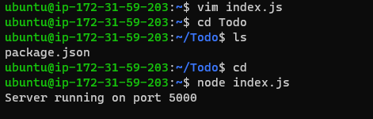

## **Documentation for Project 3**

### nodejs and nodepm Installation 

`sudo apt update`

`sudo apt upgrade`

`sudo apt-get install -y nodejs`

### node-js and node-pm installation

`node -v`

`npm -v`

### creating todo directory
`mkdir Todo`

### initializing todo project
`npm init`

### Installing Express.JS
`npm install express`
`npm install dotenv`

### Creating Model for our Application

### Mongoose Installation and creating Models Directory
`npm install mongoose`
`mkdir models`

#### MongoDb Connected Successfully
`node index.js`

### Frontend Creation
` npx create-react-app client`
` npm install concurrently --save-dev`
`npm install nodemon --save-dev`
`npm run dev`

#### Axios Installation
` npm install axios`

